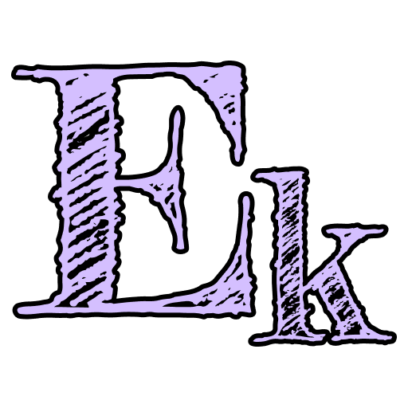

<table>
  <tbody>
    <tr>
      <td>
        

        
        

        
Hi 👋

        

          I'm a &lt;Software Engineer&gt; based in Manchester. I work independently
          and collaboratively, building high-quality products and working with the
          great teams behind them.
        

        

      </td>
      <td rowspan="2">
        <figure>
          
          <figcaption>
            
An accurate representation of my resilience

          </figcaption>
        </figure>
      </td>
    </tr>
    <tr>
      <td>
        

          For a deeper dive into my work and skills, explore my
          website: <a href="https://eraykoschell.dev/">eraykoschell.dev</a>
        

        
        
      </td>
    </tr>
  </tbody>
</table>
